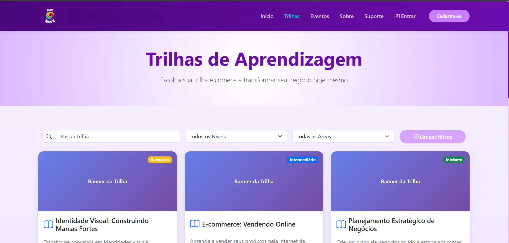
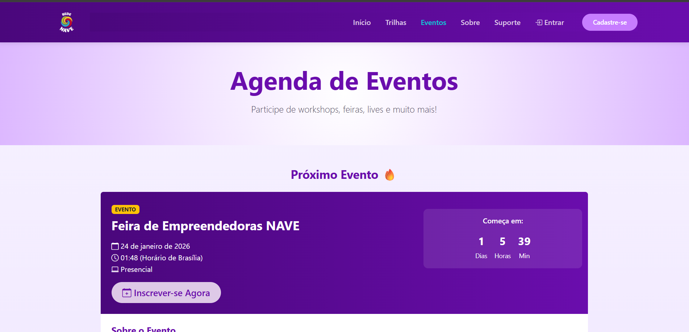
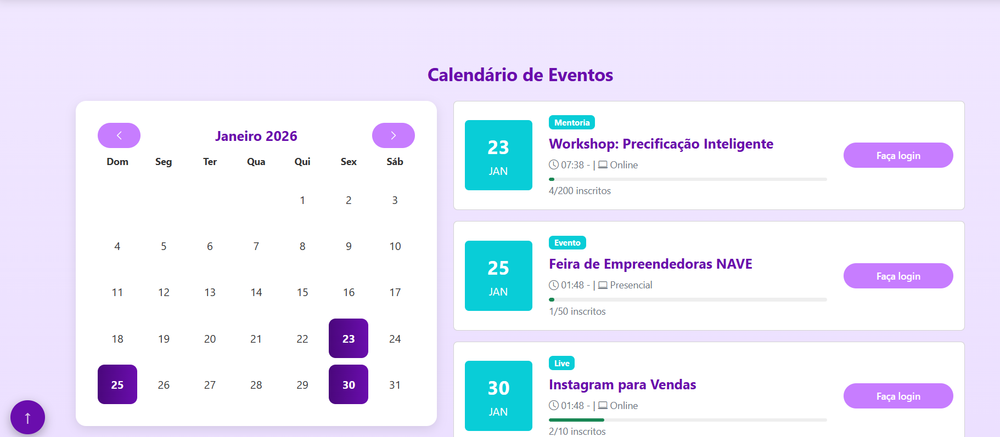
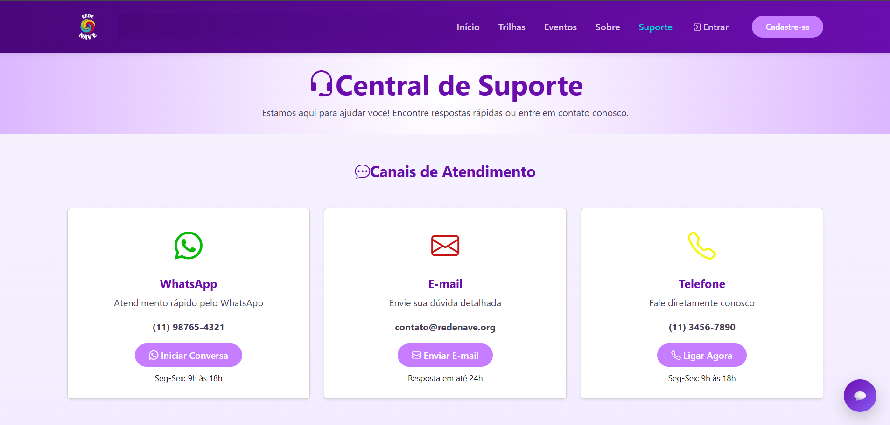
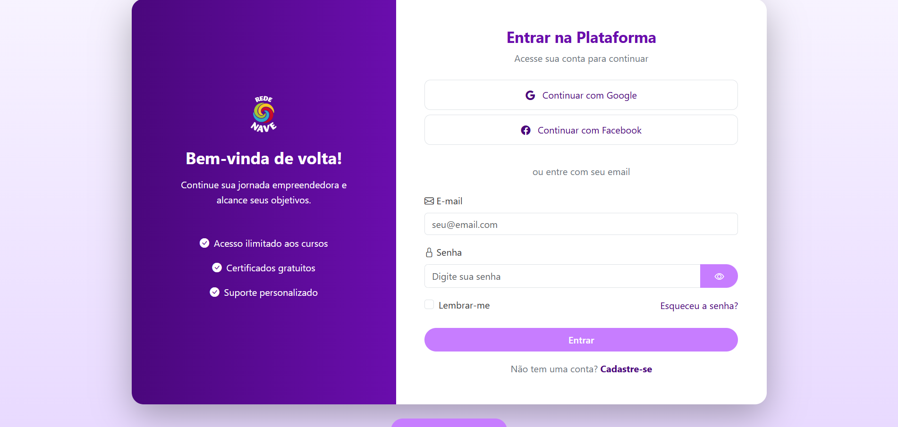
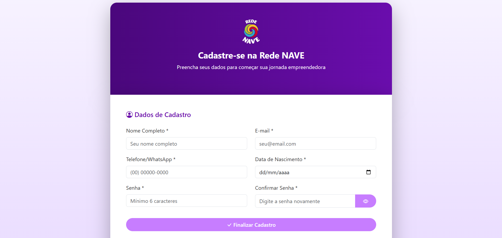
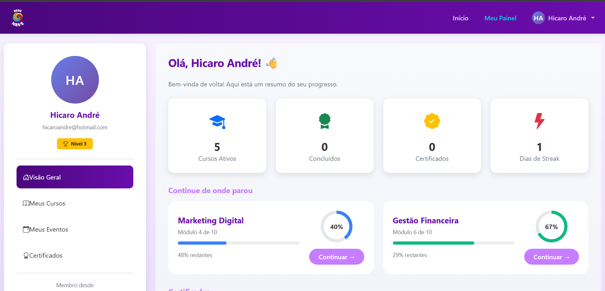
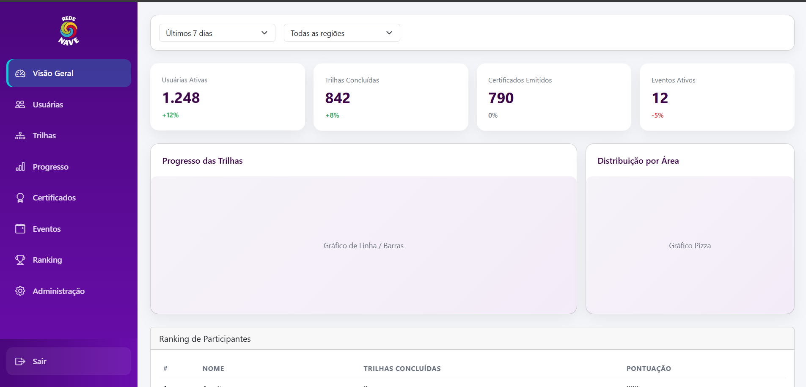

## 🔧📄 DOCUMENTAÇÃO DAS FUNCIONALIDADES

Esta documentação descreve as funcionalidades da plataforma, cobrindo interface, estrutura e detalhes técnicos. Seu propósito é auxiliar tanto na avaliação quanto na manutenção e evolução futura do projeto.

---

### Funcionalidade 1 - **Trilhas de Aprendizagem Personalizadas**

Abaixo uma captura de tela da interface para uma prévia visual:

Link disponível para melhor visualização
🔗 **[rede-nave-front.vercel.app](https://rede-nave-front.vercel.app/trilhas)** 

***Descrisão***

- A tela de Trilhas de Aprendizagem centraliza todos os percursos educacionais disponíveis na plataforma, permitindo que o usuário explore conteúdos organizados por nível, área de conhecimento e tema.

As trilhas são exibidas em formato de cards visuais, facilitando a compreensão rápida do conteúdo. Por meio da ação “Ver detalhes”, o usuário acessa a página completa da trilha, onde encontra a descrição detalhada, estrutura dos módulos e pode se inscrever para iniciar o aprendizado. Após a inscrição, a trilha passa a ficar disponível para acesso direto pelo painel do usuário.

A tela conta ainda com um sistema de busca e filtragem dinâmica, permitindo filtrar trilhas por palavra-chave, nível (iniciante, intermediário ou avançado) e área, tornando a navegação mais eficiente mesmo com grande volume de conteúdo.

---

### Funcionalidade 2 - **Agenda de Cursos e Eventos**

Abaixo uma captura de tela da interface para uma prévia visual:

Imagem 1

Imagem 2

Link disponível para melhor visualização
🔗 **[rede-nave-front.vercel.app](https://rede-nave-front.vercel.app/eventos)** 

***Descrisão***

- A Agenda de Eventos da Rede NAVE apresenta de forma clara e organizada os eventos educacionais, formativos e empreendedores da plataforma, priorizando sempre a melhor experiência do usuário.

O sistema identifica automaticamente o evento mais atual, posicionando-o em destaque na primeira tela como “Próximo Evento”, acompanhado de uma contagem regressiva em tempo real, criando senso de urgência e maior engajamento. Em seguida, um calendário mensal integrado e uma lista detalhada permitem visualizar datas, tipos de eventos, horários, modalidades e status de inscrição.

Toda a exibição é dinâmica e automatizada: os eventos são cadastrados pelo painel administrativo e ordenados por data, garantindo que o conteúdo mais relevante seja sempre exibido primeiro, sem necessidade de ajustes manuais no front-end.

---

### Funcionalidade 3 - **Canal de Comunicação e Suporte**

Abaixo uma captura de tela da interface para uma prévia visual:

Link disponível para melhor visualização
🔗 **[rede-nave-front.vercel.app](https://rede-nave-front.vercel.app/suporte)** 

***Descrisão***

- A tela da Central de Suporte da plataforma Rede NAVE foi desenvolvida para garantir atendimento ágil, acessível e multicanal, oferecendo diferentes formas de contato conforme a necessidade do usuário. A interface organiza claramente os canais de atendimento, como WhatsApp, e-mail e telefone, promovendo rapidez e facilidade na comunicação.

Além dos canais visíveis, a plataforma conta com um chatbot integrado, disponível para responder dúvidas frequentes e orientar o usuário de forma imediata, reduzindo o tempo de espera e ampliando a autonomia no uso do sistema. Complementando o atendimento, a Central de Suporte disponibiliza um formulário de contato, permitindo o envio estruturado de solicitações, dúvidas ou feedbacks diretamente pela plataforma.

O design prioriza clareza, acolhimento e usabilidade, reforçando o compromisso da Rede NAVE com suporte contínuo, experiência positiva e cuidado com suas usuárias ao longo de toda a jornada digital.
  

---

### Funcionalidade 4 - **Tela Login**

Abaixo uma captura de tela da interface para uma prévia visual:

Link disponível para melhor visualização
🔗 **[rede-nave-front.vercel.app](https://rede-nave-front.vercel.app/login)** 

***Descrisão***

- A tela de login da plataforma Rede NAVE foi projetada para garantir um acesso rápido, seguro e intuitivo. A interface oferece autenticação por e-mail e integração com provedores externos, facilitando a entrada do usuário e reduzindo barreiras no início da experiência.

O layout valoriza clareza visual, identidade consistente e usabilidade, transmitindo confiança e profissionalismo, além de reforçar o propósito social da plataforma logo no primeiro contato.
  

---

### Funcionalidade 5 - **Tela Cadastro**

Abaixo uma captura de tela da interface para uma prévia visual:

Link disponível para melhor visualização
🔗 **[rede-nave-front.vercel.app](https://rede-nave-front.vercel.app/cadastro)** 

***Descrisão***

- A tela de cadastro permite a entrada de novas usuárias de forma simples, organizada e acessível, coletando apenas as informações essenciais para iniciar a jornada na plataforma. O formulário foi estruturado com foco em experiência do usuário, legibilidade e fluidez, evitando fricções no processo de inscrição.

O design acolhedor e a comunicação direta reforçam o compromisso da Rede NAVE com inclusão, autonomia e transformação social, estabelecendo uma base sólida para o engajamento contínuo dentro da plataforma.
  

---

### Funcionalidade 6 - **Painel de Acompanhamento (Usuário)**

Abaixo uma captura de tela da interface para uma prévia visual:

Link disponível para melhor visualização
🔗 **[rede-nave-front.vercel.app](https://rede-nave-front.vercel.app/dashboard)** 

***Descrisão***

- A imagem apresenta o painel do usuário da plataforma Rede NAVE, um ambiente personalizado que reúne as principais informações da jornada de aprendizado. A interface permite acesso rápido às abas Visão Geral, Meus Cursos, Meus Eventos e Certificados, facilitando a organização e o acompanhamento das atividades na plataforma.

O painel central destaca o progresso nos cursos em andamento, incentivando a continuidade do aprendizado. O design prioriza clareza, acessibilidade e experiência do usuário, promovendo uma navegação simples e intuitiva ao longo de toda a plataforma.
  

---

### Funcionalidade 7 - **Painel de Administração e Certificação**

Abaixo uma captura de tela da interface para uma prévia visual:

Link disponível para melhor visualização
🔗 **[rede-nave-front.vercel.app](https://rede-nave-front.vercel.app/admin)** 

***Descrisão***

- A imagem apresenta a tela principal do sistema da Rede NAVE, reunindo em um único ambiente as informações essenciais para acompanhamento da plataforma. A interface foi pensada para oferecer clareza, organização e fácil navegação, com acesso rápido às funcionalidades por meio do menu lateral.

O painel central exibe dados consolidados e visuais que permitem compreender, de forma simples, o funcionamento e o alcance das atividades da plataforma, como trilhas educativas, eventos e participação das usuárias. O design moderno e responsivo reforça o foco em experiência do usuário e acessibilidade, apoiando a gestão e a evolução contínua do sistema.
  

---

⬅️ [Voltar](../docs/README.md)