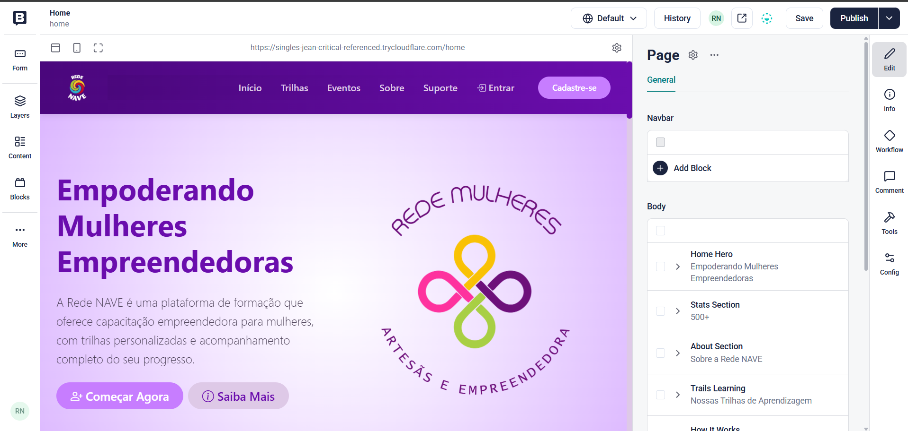

### Funcionalidade  - **Painel de CMS (Storyblok)**

Abaixo uma captura de tela da interface para uma prévia visual:

***Descrisão***

- A tela de gerenciamento de conteúdo integrada ao Storyblok permite a administração dinâmica das páginas da plataforma Rede NAVE, com preview em tempo real, garantindo que alterações sejam visualizadas imediatamente antes da publicação. Essa abordagem proporciona maior segurança e agilidade na atualização de conteúdos, sem a necessidade de alterações diretas no código.

Essa solução reforça a separação entre conteúdo e aplicação, promovendo manutenibilidade, autonomia da equipe e evolução contínua da plataforma, além de alinhar o projeto a boas práticas modernas de desenvolvimento web e gestão de conteúdo.
  

⬅️ [Voltar](../docs/README.md)