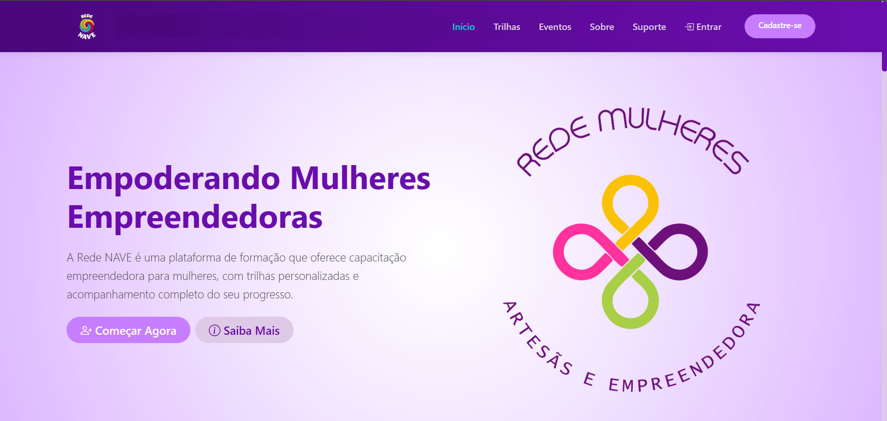

## 🎯  VISÃO GERAL

A Rede NAVE é uma plataforma digital voltada à educação, capacitação e fortalecimento do protagonismo feminino, oferecendo trilhas de aprendizagem, eventos formativos e conteúdos voltados ao desenvolvimento pessoal, profissional e empreendedor. O sistema foi desenvolvido com foco em acessibilidade, usabilidade e responsividade, promovendo uma experiência intuitiva e inclusiva para diferentes perfis de usuárias.

O sistema é destinado principalmente a mulheres empreendedoras, artesãs, estudantes e participantes de projetos sociais, bem como pessoas interessadas em formação, qualificação profissional e inclusão social. Também atende organizações, parceiros e educadores que buscam acompanhar eventos, trilhas educativas e iniciativas de impacto social promovidas pela Rede NAVE.

##  🧰 TECNOLOGIAS USADAS

- React + TypeScript
- React Router DOM
- Bootstrap 5 (Offcanvas, Grid, Utilities)
- CSS Custom Properties (Design System)
- Vite
- Storyblok (CMS Headless)

## 🚀 APLICAÇÃO ONLINE

A aplicação está disponível e pode ser acessada através do seguinte link:

🔗 **[rede-nave-front.vercel.app](https://rede-nave-front.vercel.app)** 

## 📸 PREVIEW

Abaixo uma captura de tela da interface para uma prévia visual:

***Descrisão***

- Esta interface foi projetada para a Rede NAVE, uma plataforma dedicada ao empoderamento feminino através de um design que equilibra sofisticação e funcionalidade. Utilizando uma paleta de cores moderna e uma hierarquia visual baseada em cards, a home entrega uma experiência intuitiva que prioriza a conversão e o engajamento. A estrutura apresenta de forma estratégica a missão da rede, seguida por três trilhas de conhecimento em destaque e os três principais eventos da comunidade, garantindo que o usuário encontre valor imediato. O layout ainda integra prova social através de feedbacks reais e uma seção educativa sobre o funcionamento da plataforma, unindo uma estética impecável a uma arquitetura de informação focada em reduzir a fricção e fortalecer o senso de comunidade.
  

---

⬅️ [Voltar](../docs/README.md)